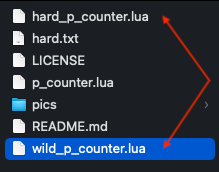

# OBS Script for a Persistent File Counter

A very simple OBS script which lets you use hotkeys to increment/decrement a counter stored in a file.

## Features
- Save counter in a file so that it persists between sessions
- Increment and Decrement the counter
- Bind Hotkeys to Increment/Decrement
- Increment and Decrement only function when the text source is active
- HotKey Descriptor so you know which hotkeys are for which script

## Using the Persistent File Counter
1. Create a text source (Just put in a place holder text for now)

2. Load up the p_counter.lua script

3. Enter a HotKey Descriptor, the previously created Text Source, and a filepath

4. Make sure to click the script "reload" button to save your settings

5. Modify your text source to read from the given file

6. Add your hotkeys to the increment/decrement buttons

## Using Multiple Counters

With the way OBS implements scripts, you won't be able to import this script multiple times to use multiple counters. To get around this, you can copy the `p_counter.lua` file multiple times with different names and import each one into OBS. This will allow you to have multiple persistent counters.

1. Copy the file and make sure it has different file names

2. Load up the various lua scripts that you have copied, and set up their settings

3. Add your hotkeys (note the hotkey descriptors being useful here)

4. Now you have multiple counters. You can even set the inc/dec hotkeys to be the same for multiple counters. Only the counters that are active will be incremented or decremented.

Unfortunately, this means that if this script if ever updated, you will need to re copy/paste the new version to all the copies you previously made before.

## Thanks
Open Broadcaster Service: https://obsproject.com/

## License
This code is provided under an MIT License.
